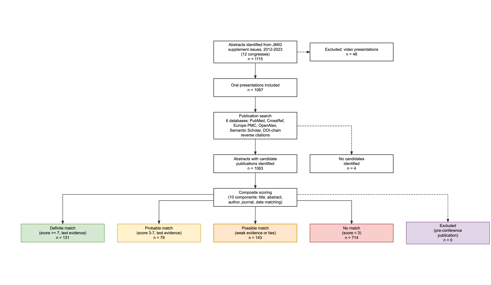

# Abstract Lifetime

[](https://opensource.org/licenses/MIT)
[](https://www.r-project.org/)
[](tests/testthat/)
[](https://mufflyt.shinyapps.io/aagl-adjudication/)

**Publication Rate, Time to Publication, and Predictors of Full Publication Among Oral Presentations at the AAGL Global Congress, 2012-2023**

A fully automated, reproducible pipeline that tracks whether conference abstracts presented at the AAGL Global Congress on Minimally Invasive Gynecology progress to full peer-reviewed publication. Designed to meet the methodological standards recommended by the [Cochrane review on full publication of results initially presented in abstracts](https://doi.org/10.1002/14651858.MR000005.pub4) (Scherer et al., 2018).

**[Live Adjudication App](https://mufflyt.shinyapps.io/aagl-adjudication/)** | **[Technical Appendix](docs/technical_appendix.Rmd)** | **[Manuscript](docs/abstract_results_section.Rmd)**

---

## Flow Diagram



## Installation

```bash
git clone https://github.com/mufflyt/abstract_lifetime.git
cd abstract_lifetime
```

```r
# Install required packages
install.packages(c(
  "tidyverse", "here", "config", "cli", "rentrez", "xml2", "httr",
  "jsonlite", "survival", "broom", "gender", "stringdist", "digest",
  "rvest", "purrr", "DiagrammeR", "htmlwidgets", "webshot2", "scales"
))

# Optional (Shiny app + deployment)
install.packages(c("shiny", "bslib", "DT", "shinyjs", "googlesheets4", "rsconnect"))

# Optional (gender inference for international names)
install.packages("gender")
```

## Quick Start

```r
# Full pipeline (3-4 hours cold, ~30 min with cache)
Rscript 00_run_all.R

# Render manuscript
rmarkdown::render("docs/abstract_results_section.Rmd")
rmarkdown::render("docs/technical_appendix.Rmd")

# Run tests (391 tests)
testthat::test_dir("tests/testthat")

# Deploy Shiny adjudication app
Rscript shiny/adjudication_app/deploy.R

# Run demographics pipeline only (skip scraping + search)
Rscript R/run_demographics.R
```

## Pipeline Architecture

```
00_run_all.R                         # Master pipeline (runs all steps sequentially)
R/
  01b_parse_web.R                    # Step 1: Scrape JMIG supplements from ScienceDirect
  01d_tag_session_type.R             # Step 1d: Classify Oral vs Video from TOC
  02_clean_abstracts.R               # Step 2: Normalize + extract 20+ predictor variables
  03_search_pubmed.R                 # Step 3: 6-strategy PubMed search per abstract
  03b_search_crossref.R              # Step 3b: CrossRef + Europe PMC + OpenAlex + Semantic Scholar
  03c_doi_chain_search.R             # Step 3c: Reverse citation search via OpenAlex
  04_score_matches.R                 # Step 4: 10-component composite scoring
  05_adjudicate.R                    # Step 5: Cochrane-aligned 5-tier classification
  09b_enrich_pub_types.R             # Step 5b: PubMed publication type extraction
  09_enrich_authors.R                # Step 5c: Author names + affiliations from PubMed XML
  09c_author_characteristics.R       # Step 5d: Gender, ACOG district, practice type
  09d_enrich_metrics.R               # Step 5e: Citation counts + journal impact from OpenAlex
  09f_enrich_gender_from_pubmed.R    # Step 5f: Gender from PubMed full-name search
  09g_gender_from_orcid.R            # Step 5g: Gender from ORCID person records
  09h_gender_from_obgyn_pubs.R       # Step 5h: Gender from OB/GYN publication search
  09i_gender_from_openalex.R         # Step 5i: Gender from OpenAlex author search
  09j_gender_from_open_payments.R    # Step 5j: Gender from CMS Open Payments
  10_npi_matching.R                  # Step 6a: NPI identity resolution (ABOG + NPPES)
  10b_resolve_names_openalex.R       # Step 6b: Full name resolution via OpenAlex DOIs
  10d_orcid_demographics.R           # Step 6c: ORCID demographics enrichment
  10e_merge_demographics.R           # Step 6d: SOLE MERGE — unified demographics waterfall
  10f_senior_author_triangulation.R  # Step 6e: Name resolution via senior coauthor
  10g_second_author_triangulation.R  # Step 6f: Name resolution via second coauthor
  run_demographics.R                 # Demographics orchestrator (runs 09c-10e in order)
  06_analyze_results.R               # Step 7: KM, Cox PH, logistic regression, sensitivity
  07_make_tables.R                   # Step 7: 4 publication-quality tables
  08_make_figures.R                  # Step 8: 6 main + 4 supplementary figures
  utils_acog.R                       # US state -> ACOG district mapping
  utils_affiliation.R                # Practice type, subspecialty, career stage from affiliations
  utils_classify.R                   # Study design, research category, procedure classifiers
  utils_congresses.R                 # Multi-congress date lookup
  utils_crossref.R                   # CrossRef/OpenAlex/EuroPMC/SemanticScholar API wrappers
  utils_positivity.R                 # Result direction classifier (positive/negative/neutral)
  utils_pub_types.R                  # PubMed PublicationType canonicalization
  utils_pubmed.R                     # PubMed E-Utilities search + XML parsing
  utils_scoring.R                    # Composite match scoring algorithm
  utils_states.R                     # US state parsing from affiliation text
  utils_text.R                       # Text normalization, Jaccard similarity, keywords
  validation_gold_standard.R         # Gold standard validation + threshold tuning
scripts/
  build_gold_standard.R              # Intensive PubMed verification of sampled abstracts
  prefill_algorithm_decisions.R      # Push AUTO decisions to Google Sheet
  backfill_*.R                       # Backfill new columns onto existing sheet rows
  cleanup_no_match_rows.R            # Blank matched-pub fields on no_match decisions
  rescue_2016.R                      # Recovery script for rate-limited congress years
shiny/adjudication_app/deploy.R      # Build bundle + slim data + deploy to shinyapps.io
```

## Search Strategy

Six PubMed strategies per abstract, plus four supplementary databases and a novel DOI-based reverse citation search:

| Source | Method |
|--------|--------|
| PubMed | Title phrase, first/last author, author+keywords, distinctive phrase, author broad |
| CrossRef | Title-based (low-hit abstracts) |
| Europe PMC | Multi-strategy title + author |
| OpenAlex | Keyword search with PMID resolution |
| Semantic Scholar | Title-based |
| DOI-chain | Reverse citations via OpenAlex (papers citing the abstract DOI) |

## Matching Algorithm

10-component composite score (title similarity, abstract semantic, first/last/coauthor match, journal relevance, keywords, publication date) with Cochrane-aligned classification:

- **Definite** (score >= 7 + text evidence): auto-accepted
- **Probable** (score 3-7 + text evidence): human review required
- **Possible** (weak evidence or ties): human review required
- **No match** (score < 3): no viable publication found
- **Excluded**: candidate published before the conference

## Shiny Adjudication App

Live at **https://mufflyt.shinyapps.io/aagl-adjudication/**

Web-based tool for blinded manual review of probable/possible matches:

- Side-by-side abstract vs candidate comparison
- Per-component score breakdowns
- Google Sheets backend for multi-reviewer collaboration
- Keyboard shortcuts (m/n/s/Enter/arrows)
- Filters by congress year (2012-2023), classification tier
- Conflict detection between reviewers
- Help tooltips on every control

## Variable Extraction

59 columns per abstract, extracted via NLP and API enrichment:

| Category | Variables |
|----------|-----------|
| Study characteristics | study_design (12 categories), research_category, primary_procedure, is_rct, sample_size, is_multicenter |
| Cochrane variables | has_funding, has_industry, has_trial_registration, has_irb_statement, has_numeric_results, is_database_study |
| Author demographics | gender_unified (99% coverage), practice_type (18%), subspecialty_unified (36%), state_unified (31%), ACOG district, n_authors |
| NPI identity resolution | npi_number, npi_match_confidence, npi_subspecialty, npi_state (278 high-confidence matches, 40% of US authors) |
| Publication outcomes | pub_type_canonical, cited_by_count, journal_impact_proxy, months_to_pub |
| Match quality | classification, best_score, 10 score components, has_tie |

## Figures

**Main manuscript** (6 figures):

1. STROBE flow diagram
2. Kaplan-Meier cumulative publication curve (pooled)
3. KM curves stratified by congress year
4. Publication rate by subgroup (study design, practice type, subspecialty, geography, gender)
5. Cox PH forest plot (hazard ratios with 95% CI)
6. Time to publication histogram

**Supplementary** (4 figures): publication rate by year, search strategy comparison, score distribution, classification breakdown by year

## Testing

391 tests across 13 test files:

- **Unit tests**: text normalization, scoring, state parsing, ACOG mapping, gender, affiliation classification, study design, research category, procedure classification, publication type canonicalization
- **Semantic tests**: pipeline output plausibility checks against Cochrane MR000005 benchmarks (publication rate bounds, time-to-publication bounds, classification vocabulary, predictor coverage thresholds, Cox PH validity)
- **Integration tests**: Shiny app data integrity, Google Sheets schema consistency

```r
testthat::test_dir("tests/testthat")
# [ FAIL 0 | WARN 13 | SKIP 18 | PASS 391 ]
```

## Reproducibility

- All API responses cached to disk (PubMed XML, ScienceDirect HTML)
- RDS checkpoints at each search stage (resume after interruption)
- `set.seed(42)` for reproducible sampling
- Manuscript Rmd files use inline R code pulling from pipeline CSVs
- Full re-run with populated cache: ~30 minutes

## Project Structure

```
data/
  processed/          # Intermediate pipeline outputs (abstracts, candidates, scores)
  cache/              # API response cache (PubMed XML, ScienceDirect HTML) [gitignored]
  validation/         # Gold standard (50 abstracts) + ACGME teaching hospital names
output/
  *.csv               # Analysis results (aims 1-5, sensitivity, publication bias)
  tables/             # Publication-quality tables (Table 1-4)
  figures/            # Main (6) + supplementary (4) figures
docs/
  abstract_results_section.Rmd    # Full manuscript (Introduction + Methods + Results)
  technical_appendix.Rmd          # Technical appendix (pipeline details)
  reviewer_email.md               # Template email for adjudication reviewers
shiny/
  adjudication_app/   # Shiny app for human review of matches
tests/
  testthat/           # 391 automated tests
config.yml            # All pipeline parameters (congresses, thresholds, API settings)
```

## Requirements

- R >= 4.4
- Key packages: tidyverse, rentrez, xml2, httr, jsonlite, survival, gender, stringdist, humaniformat, DiagrammeR
- Optional: googlesheets4 (Shiny backend), rsconnect (deployment), webshot2 (flow diagram PNG)
- DuckDB database: `/Volumes/MufflySamsung/DuckDB/nber_my_duckdb.duckdb` (for NPI matching, Mac-local)
- ABOG-NPI file: `isochrones/data/canonical_abog/canonical_abog_npi_LATEST.csv` (for NPI matching)

## API Keys & Environment Variables

The pipeline uses several external APIs. All work without keys but with lower rate limits. Set these in `~/.Renviron` for better performance:

```bash
# NCBI E-Utilities (PubMed search) — 3 req/sec without key, 10 req/sec with key
# Get one at: https://www.ncbi.nlm.nih.gov/account/settings/ → "API Key Management"
ENTREZ_KEY=your_ncbi_api_key_here

# genderize.io (international gender inference) — 100 req/day free, unlimited with key
# Get one at: https://store.genderize.io/ (free tier available)
GENDERIZE_API_KEY=your_genderize_key_here

# Google Sheets (Shiny adjudication app backend)
# Place service account JSON at: shiny/adjudication_app/google_credentials.json
# Get one at: https://console.cloud.google.com → IAM & Admin → Service Accounts → Create Key
GOOGLE_SHEETS_ID=your_google_sheet_id_here

# Contact email for polite API pools (OpenAlex, CrossRef)
# Used in User-Agent headers per API terms of service
PIPELINE_EMAIL=your.email@example.com
```

**No-key APIs** (work without authentication):
- **OpenAlex** — polite pool with `mailto` parameter (set via `PIPELINE_EMAIL`); no key needed
- **CrossRef** — polite pool with `mailto`; no key needed
- **Europe PMC** — fully open; no key needed
- **Semantic Scholar** — public API; no key needed (rate limited to ~100 req/5min)
- **ORCID** — public API for reading; no key needed
- **NPPES/NPI Registry** — public API; no key needed

**shinyapps.io deployment** (optional):
```r
# Configure once — get token at https://www.shinyapps.io/admin/#/tokens
rsconnect::setAccountInfo(name = "your_account", token = "YOUR_TOKEN", secret = "YOUR_SECRET")
```

## Contributing

Contributions welcome. Please:

1. Fork the repository
2. Create a feature branch (`git checkout -b feature/your-feature`)
3. Add tests for new functionality
4. Ensure `testthat::test_dir("tests/testthat")` passes
5. Submit a pull request

## License

MIT License. See [LICENSE](LICENSE) for details.
