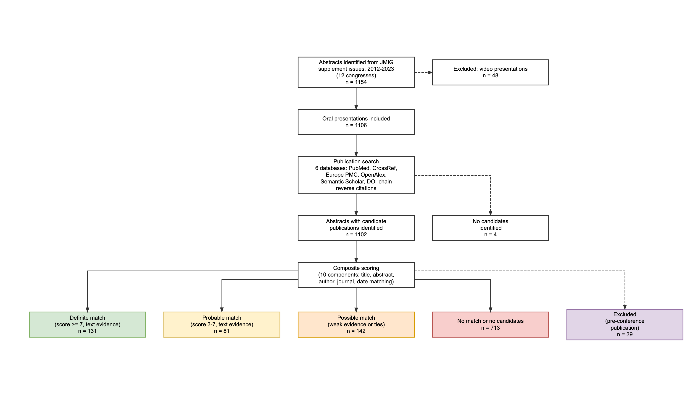
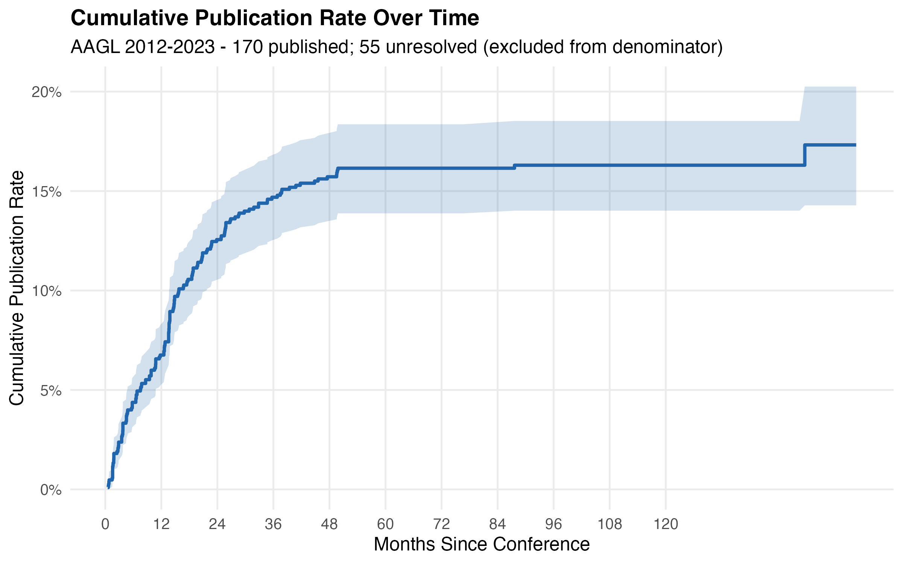
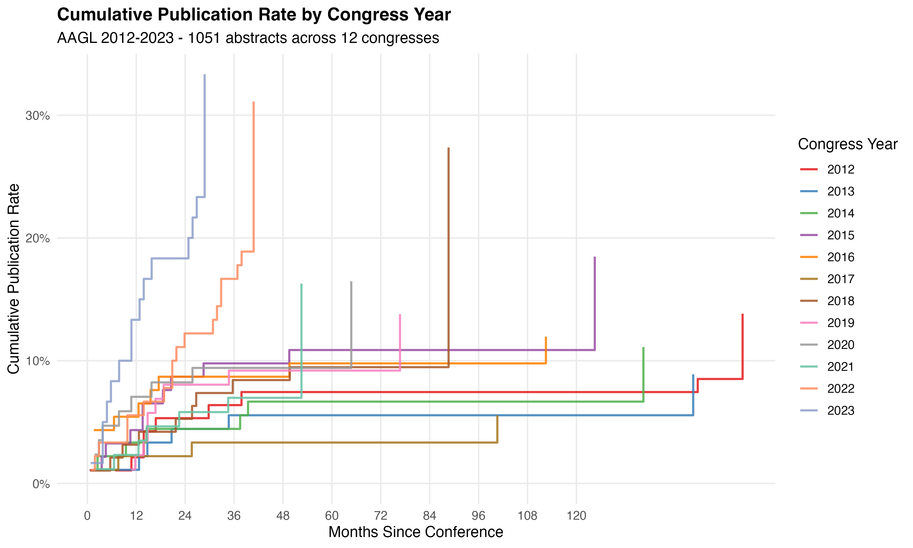
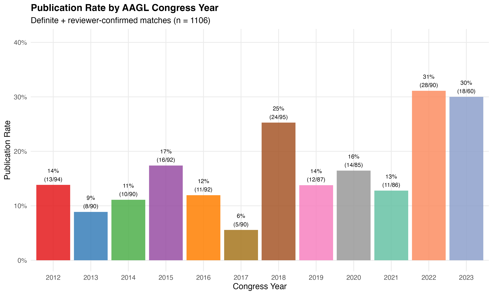
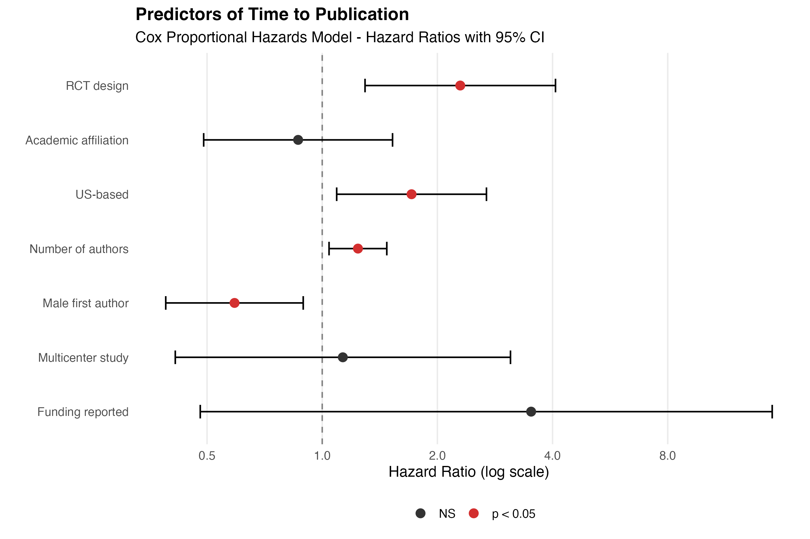
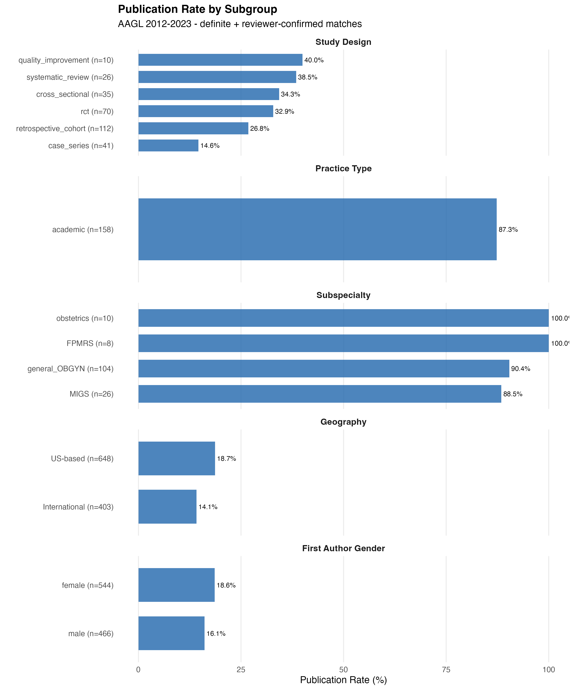
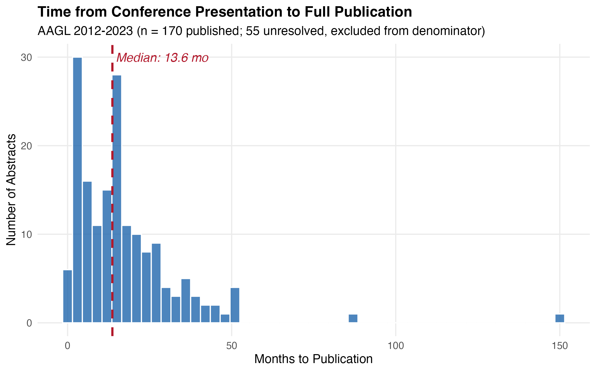
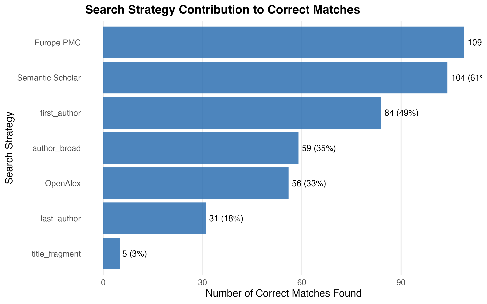

# Abstract Lifetime

[](https://opensource.org/licenses/MIT)
[](https://www.r-project.org/)
[](docs/VALIDATION.md)
[](https://mufflyt.shinyapps.io/aagl-adjudication/)

**Publication Rate, Time to Publication, and Predictors of Full Publication
Among Oral Presentations at the AAGL Global Congress, 2012–2023**

A reproducible pipeline that tracks whether abstracts presented orally at the
AAGL Global Congress on Minimally Invasive Gynecology go on to full peer-reviewed
publication. Abstracts are ingested from the *Journal of Minimally Invasive
Gynecology* congress supplements, searched against six bibliographic sources,
scored by a composite matching algorithm, adjudicated by human reviewers, and
analysed against the methodological standards of the
[Cochrane review on full publication of results initially presented in abstracts](https://doi.org/10.1002/14651858.MR000005.pub4)
(Scherer et al., 2018).

---

## Headline result

**16.2%** of AAGL oral presentations reached full peer-reviewed publication —
**170 of 1,051 evaluated** (95% CI 14.1–18.5). The cohort is **1,106** oral
presentations; a further **55** remain unresolved in adjudication and are
excluded from the denominator. For context, the Cochrane review of this
literature reports a pooled rate near 45% across specialties.

Median time from congress to publication was **13.6 months** (IQR 5.7–22.4),
computed on the 170 published abstracts whose publication follows their
congress. Seven confirmed publications appeared shortly *before* their meeting
and are excluded from that summary but counted in the numerator.

> Cohort 1,106 and denominator 1,051 are different quantities. See
> [docs/COHORT_ASSEMBLY.md](docs/COHORT_ASSEMBLY.md).

### Cohort assembly


**This is Figure 1**, and it is the only one. Generated by
`R/strobe_flowchart.R`, which derives every count from the pipeline files and
asserts the arithmetic with `stopifnot()` before drawing, so the diagram cannot
drift from the data. `tests/testthat/test-figure1_flow_contract.R` re-derives
every box on each push and checks these numbers against this alt text.

The companion below is **not** a second Figure 1. It is a different cut of the
same cohort -- the algorithmic classification tiers, which the STROBE chart does
not show -- and it carries no figure number because it is not a numbered figure
in the manuscript. It comes from `R/08_make_figures.R` and, unlike the chart
above, asserts nothing about its own arithmetic beyond the tier partition
checked in `test-cycle05_flow_fidelity_tables.R`.



Two counts of "pre-conference" appear in these figures and they are not the
same. The scorer flags **39** abstracts whose *top candidate* predates the
congress, which is the classification tier above. The outcome rule is applied to
the publication actually credited to each abstract, and finds **42**. The 39 are
a strict subset; the extra three are two abstracts where a reviewer supplied a
PMID other than the top candidate, and one scored `definite` whose paper
predates its congress by two weeks. See
[docs/OUTCOME_DEFINITION.md](docs/OUTCOME_DEFINITION.md) and appendix A19.

### Cumulative publication over time



Publication is overwhelmingly an early event. Abstracts that have not appeared
within roughly three years of the congress rarely publish at all.

### Publication trajectory by congress year



Recent congresses carry less follow-up and are right-censored. Note that the
crude rate *rises* with congress recency, the opposite of what censoring alone
predicts:



Two congresses drive much of that shape. 2017 and 2018 have no recoverable
abstract text (1 of 97 and 0 of 95), so every text-derived covariate is near
zero for them — see [Known limitations](#known-limitations).

### Predictors of time to publication



Randomized design (HR 2.00, 95% CI 1.34–3.00) is associated with faster
publication. **Academic affiliation is not** (HR 1.10, 0.78–1.55, p = 0.59):
the apparent protective effect reported earlier was an artefact of deriving
academic status from abstract body text rather than from the author's
affiliation, and it disappears once the affiliation is read (appendix A21). US
location (HR 0.79, 0.58–1.08), male first authorship (HR 0.75, 0.55–1.02) and
multicenter conduct (HR 1.36, 0.79–2.34) are not statistically distinguishable
from no effect. `has_funding` is not a term in this model — the
near-zero-variance screen removes it (TRUE for 7 of 1,051).

Author count is reported separately below, because its effect is not constant.

#### Author count: the hazard ratio changes with follow-up


The Cox model reports HR 1.25 per additional author (1.09–1.44, p = 0.002), and
that single number is the **only** proportional-hazards violation in the model
(`cox.zph` p = 0.003 for this term; `is_us_based` also violates at p = 0.005). Refitting it
with a log-time interaction shows what the constant was averaging: no detectable
effect at three months (HR 1.01, 0.84–1.22), rising to 1.32 (1.13–1.53) at one
year and 1.51 (1.24–1.83) at two. Team size does not buy speed to first
publication — it predicts which abstracts are still becoming papers years later.

Read this with the ceiling in mind: `n_authors` is truncated at 5 by the source
ingest, and 49.3% of the model frame sits at that cap.

Two cautions. Only two terms are robust to resampling:
across 500 bootstrap refits, `is_rct` is retained 93.2% of the time and
`n_authors` 88.6%, while `is_academic` survives only 5.6% — it is significant in
eleven of twelve leave-one-congress-out refits, so it is close to
congress-independent, but it is not sampling-robust either. And `has_funding` is now
excluded from both models by a near-zero-variance rule (TRUE for 7 of 1,051).
See `output/model_predictor_stability.csv` and
`output/model_variable_screen.csv`.

### How much do those estimates depend on the sample?


Only two terms survive resampling. `is_academic` reaches p = 0.020 in the fitted
model but holds in under two-thirds of bootstrap refits — although it *is*
significant in eleven of twelve leave-one-congress-out refits, so it is close to
congress-independent. The two diagnostics measure different things and both
belong in the reading. See [docs/STATISTICAL_ANALYSIS.md](docs/STATISTICAL_ANALYSIS.md).
Author gender is **registry-reported for 267 of 1,066 abstracts and inferred
from a name for the rest**, 287 of those from a single first initial; 231 carry
a cross-source disagreement recorded in `gender_conflict`.

### Other figures





Search-strategy yield, which is the evidence behind one of the open decisions in
[DECISIONS_PENDING.md](docs/DECISIONS_PENDING.md): the `title` strategy is a
pre-correction measurement, and a sixth strategy, `author_keywords`, never ran at
all because the cohort carries no keywords column.



The composite match-score distribution, which is what the adjudication
thresholds cut across. The mid-score band is the one escalated to human review.


The same classification, split by congress year. The search ran once across all
twelve years, so a year-specific artefact would appear here as a step change.
None does — the mix is stable, which is what licenses pooling the years.


The `excluded` band is abstracts whose only candidate publication predates the
congress. They leave the numerator, not the denominator — see
[docs/OUTCOME_DEFINITION.md](docs/OUTCOME_DEFINITION.md).

One further supplementary figure is generated into `output/figures/` but not
tracked.

---

## Pipeline

```
ScienceDirect JMIG supplements (12 congress issues)
        │  01b_parse_web.R + 01d_tag_session_type.R
        ▼
   1,154 presentations
        │  02_clean_abstracts.R  (−48 video)
        ▼
   1,106 oral presentations  ── the COHORT
        │  03 / 03b / 03c   PubMed · CrossRef · Europe PMC ·
        │                   OpenAlex · Semantic Scholar · DOI chain
        ▼
   64,718 scored (abstract × candidate) pairs
        │  04_score_matches.R   10-component composite score
        ▼
   definite 131 · probable 81 · possible 142 · no_match 709 ·
   excluded 39 · no_candidates 4
        │  05_adjudicate.R → Shiny app → Google Sheets
        ▼
   1,153 adjudicated decisions (3 human reviewers + an AUTO pass)
        │  06_analyze_results.R   utils_decisions.R
        ▼
   1,051 evaluated → 170 published · 881 not · 55 unresolved
        │  07_make_tables.R · 08_make_figures.R · strobe_flowchart.R
        ▼
   final_analytical_dataset.csv (1,106 × 92), tables, figures
```

Full stage-by-stage detail, including a Mermaid DAG:
[docs/PIPELINE.md](docs/PIPELINE.md) ·
machine-readable: [docs/pipeline_manifest.yml](docs/pipeline_manifest.yml)

---

## Quick start

```bash
git clone https://github.com/mufflyt/abstract_lifetime.git
cd abstract_lifetime
```

```r
install.packages(c(
  "tidyverse", "here", "config", "cli", "rentrez", "xml2", "httr",
  "jsonlite", "survival", "broom", "gender", "stringdist", "digest",
  "rvest", "purrr", "yaml", "flowchart", "DiagrammeR", "htmlwidgets",
  "webshot2", "scales", "npi", "naniar"
))

# Optional but recommended: supplies NPPES registry gender (waterfall tier 1),
# Table 1 with p-values, join safety in the demographics merge, Little's MCAR
# test, and the session snapshot. Every use degrades gracefully without it.
remotes::install_github("mufflyt/mysterycall@42d66d92ef52a0f85d1f7c61208c2ddd79d9c06e")
```

**Reproduce the reported numbers from tracked files** (works from a clean clone,
takes about a minute):

```r
source("R/06_analyze_results.R")   # outcome, all five aims, models
source("R/07_make_tables.R")
source("R/08_make_figures.R")
source("R/strobe_flowchart.R")
testthat::test_dir("tests/testthat")
```

**Re-run the whole pipeline** — see the caveats below first:

```r
Rscript 00_run_all.R   # 3-4 h cold, ~30 min warm; now includes the
                       # demographics merge and the STROBE flow chart
```

If `data/processed/pubmed_candidates.csv` is missing or predates
`match_scores.csv`, repair it before running steps 4-6:

```r
Rscript scripts/rebuild_candidate_pool.R
```

---

## Documentation

| Document | Answers |
|---|---|
| [COHORT_ASSEMBLY.md](docs/COHORT_ASSEMBLY.md) | What exactly is the denominator, and what happened to every parsed abstract? |
| [PIPELINE.md](docs/PIPELINE.md) | Every stage: input → transformation → output, with a DAG |
| [PUBLICATION_SEARCH.md](docs/PUBLICATION_SEARCH.md) | Every search query, verbatim, per source |
| [MATCHING_ALGORITHM.md](docs/MATCHING_ALGORITHM.md) | The composite score, component by component, with thresholds |
| [OUTCOME_DEFINITION.md](docs/OUTCOME_DEFINITION.md) | When does an abstract count as published? (Methods-ready) |
| [ADJUDICATION.md](docs/ADJUDICATION.md) | Human review: schema, precedence, and the decision accounting |
| [DATA_DICTIONARY.md](docs/DATA_DICTIONARY.md) · [CSV](docs/data_dictionary.csv) | All 93 variables with derivation and coverage |
| [DATA_INVENTORY.md](docs/DATA_INVENTORY.md) · [CSV](docs/data_inventory.csv) | All 74 data files with producer, consumers and grain |
| [AUTHOR_ENRICHMENT.md](docs/AUTHOR_ENRICHMENT.md) | Identity resolution and the ten-tier gender waterfall |
| [STATISTICAL_ANALYSIS.md](docs/STATISTICAL_ANALYSIS.md) | Every model as fitted, with diagnostics |
| [RESULTS_PROVENANCE.md](docs/RESULTS_PROVENANCE.md) | Every reported number → the file and code that produced it |
| [SOURCE_OF_TRUTH.md](docs/SOURCE_OF_TRUTH.md) | Which file wins when two disagree |
| [REPRODUCIBILITY.md](docs/REPRODUCIBILITY.md) | What a clean clone gets, and what it does not |
| [FAILURE_MODES.md](docs/FAILURE_MODES.md) | Seventeen ways this pipeline can be plausibly wrong, and which nine are now fixed |
| [VALIDATION.md](docs/VALIDATION.md) | The test suite and the invariants that have no test |
| [TEST_GOVERNANCE.md](docs/TEST_GOVERNANCE.md) | What "green" means: the gate, both manifests, and why a skipped test is not a passing one |
| [DECISIONS_PENDING.md](docs/DECISIONS_PENDING.md) | Every open decision, generated from the expected-failure manifest |
| [METHODOLOGICAL_HISTORY.md](docs/METHODOLOGICAL_HISTORY.md) | Corrections, with their effect on the numbers |
| [technical_appendix.Rmd](docs/technical_appendix.Rmd) | Extended appendices A1–A15. **A14** verifies the cohort truncation against Crossref; **A15** is the September 2026 remediation record |

---

## What requires manual or external data

| Component | Status |
|---|---|
| Human adjudication (1,263 decisions, 3 reviewers) | **Manual.** Tracked in `output/manual_review_decisions.csv`; the live store is a Google Sheet requiring a service-account key. |
| Gold standard (50 abstracts) | **Manual.** Tracked. Cannot be regenerated by code. |
| International gender lookup (300 names) | **Manual.** Tracked. |
| ACGME teaching-hospital list (2,754 names) | External snapshot, tracked, no retrieval script. |
| `data/cache/sd_html/` (1,154 files) | **Gitignored and unrefetchable** — ScienceDirect returns HTTP 403. This cache is currently the only copy of the source documents. |
| Shiny adjudication app | The bundle is verified current and `deploy.R` refuses to publish a stale one, but **the live app at shinyapps.io still serves April data** until someone runs `SHINY_DEPLOY=true Rscript shiny/adjudication_app/deploy.R`. |
| `data/processed/pubmed_candidates.csv` (≈130 MB) | **Gitignored.** A clean clone cannot run steps 4–5 without re-running the search, or `scripts/rebuild_candidate_pool.R` against `match_scores_detailed.rds`. |
| NPI matching | **Not currently regenerable.** Both inputs now come from `config.yml: external_data` (`ABOG_NPI_PATH`, `NPPES_DUCKDB_PATH`). Both files exist on this machine, but the ABOG `LATEST` symlink now targets a workforce export with no gender column and NPIs on 411 of 79,400 rows, so `R/10_npi_matching.R` refuses to overwrite the richer shipped sidecar. |
| 2017 abstract text | **Irrecoverable** without institutional PDF access (CORS blocks the jmig.org scraper; no Wayback snapshots). 96 of 97 abstracts have no text. |

---

## Test status

56 test files. As of 2026-09-05, measured in a clean `git worktree` so the
numbers are what CI sees rather than what a developer machine sees:
**1,723 passing, <!--manifest-count-->21<!--/manifest-count--> failing,
12 skipped.**

The failing count is written as a marker and checked against
[`tests/expected_failures.yaml`](tests/expected_failures.yaml) by
`tests/testthat/test-decision_registry.R`, so it cannot drift the way the
hand-maintained tables it replaced did.

The other two are observations, not registrations, and are deliberately not
checked. The pass total moves on almost every commit. The skip total is
environment-dependent by design: `tests/expected_skips.yaml` registers 13
approved skips, and 12 of them actually skipped in this run — an approved skip
that manages to run is not an error, which is why the gate fails on *unapproved*
skips only.

Every failure is deliberately left red, each marking a decision that belongs to
the author rather than to code. The full list, with the reason and the decision
each is waiting on, is generated into
[docs/DECISIONS_PENDING.md](docs/DECISIONS_PENDING.md). Two of them move a number
that appears in the manuscript:

| Failing test | What it reports |
|---|---|
| `test-cycle22_decision_log.R` | Four *different* abstracts are counted as published against an explicit human `no_match` |

CI runs five gates in order: decision-logic boundary contracts, mutation tests,
the two identity guards, then the full suite measured against **both** manifests,
[`tests/expected_failures.yaml`](tests/expected_failures.yaml) and
[`tests/expected_skips.yaml`](tests/expected_skips.yaml).

The second manifest is new, and it closes a hole that had already cost two days
of red `main`. The gate used to treat a skipped test as a passing one, so a test
that quietly stopped asserting anything was counted as coverage. **75 assertions
ran only on a developer machine; 52 of them are now enforced in CI**, including
`F2: every winning PMID resolves in the candidate pool`, a central pipeline
invariant that had never once run there. The 23 that remain are genuinely
environment-bound and each records what it would take to enable it.

See [docs/TEST_GOVERNANCE.md](docs/TEST_GOVERNANCE.md) for the gate, both
manifests, and why an authoritative gate result has to come from a clean
worktree. Full inventory and the list of invariants that have **no** test:
[docs/VALIDATION.md](docs/VALIDATION.md).

## Known limitations

1. **The cohort is truncated, and it is not a random sample.** The
   ScienceDirect listing scraper captures only the first ~100 items per congress
   supplement, against 392–852 items deposited in Crossref: 1,154 of 7,711
   overall. The captured set is the **first N pages of each supplement in
   printed order**, ending at S26–S60 against supplements running to S136–S286.

   Publication rate declines weakly across the captured window (position odds
   ratio 0.607, p = 0.080, adjusted for congress year), so the reported rate is
   best read as an estimate for **early-programme oral presentations**, with a
   possible downward correction of unknown size if applied to a complete
   congress. RCTs are more frequent in the last captured quintile, which cuts
   the other way.

   The truncation cannot currently be closed: ScienceDirect returns HTTP 403,
   no supplement PDFs are held, and the Crossref deposit — which is complete,
   public and cached — carries **no session type**, so uncaptured oral
   presentations cannot be told from videos or posters. See
   [appendix A23](docs/technical_appendix.Rmd) for the evidence and a costed
   probe-study design.
2. **2017 and 2018 have no recoverable abstract text at all** (1 of 97 and 0 of
   95). Every text-derived covariate is near zero for those two congresses, and
   congress year is in neither model, so they act as a measurement-driven
   stratum. The wider 2012–2018 version of this problem was a derivation-ordering
   bug and is fixed. [F3](docs/FAILURE_MODES.md)
3. **A failed API call is indistinguishable from a genuine zero result.** No
   retry, no error column, and the checkpoint marks the abstract complete, so a
   transient NCBI outage leaves a permanently under-searched abstract. [F5](docs/FAILURE_MODES.md)
4. **Search checkpoints resume but never invalidate.** Editing a query does not
   re-run it for an already-completed abstract. [F6](docs/FAILURE_MODES.md)
5. **`aim1_by_practice_type.csv` and `aim1_by_subspecialty.csv` are rates
   conditional on a match having been found**, not publication rates — the
   stratifiers come from the matched publication's affiliation. The files now
   carry the availability split that proves it. [F4](docs/FAILURE_MODES.md)
6. Author gender is registry-reported for 267 of 1,066 abstracts (NPPES, then
   ABOG) and name-inferred for the rest; 287 rest on a single first initial and
   231 carry a cross-source disagreement.
7. `n_authors` is censored at 5 by ScienceDirect's author-list truncation, and
   is a significant term in both models.
8. Publication dates are print/issue dates; `ArticleDate` is not read. Eleven
   pre-congress exclusions rest on year-only dates resolved to 1 January.
   Changing this would re-score every candidate and invalidate the human
   adjudication, so it has not been changed. [F14](docs/FAILURE_MODES.md)
9. The composite score is described as ten-component but `keyword_pts` is 0 for
   every abstract, so nine are live. Fixing it has the same re-scoring
   consequence as above.
10. The 55 unresolved abstracts are removed from the denominator, and they are
    **not** missing completely at random — they differ from the evaluated set on
    `study_design` (p = 0.0004) and `n_authors` (p = 0.013), the latter a
    significant predictor in both models. Bounds: 16.1% if all unpublished,
    21.1% if all published. See `output/unresolved_vs_evaluated.csv`.
11. The proportional-hazards assumption is **violated** (global p = 0.010), and
    the violation is confined to `n_authors` (p = 0.002). That term is fitted
    with a log-time interaction and reported as a time-varying hazard ratio;
    the other five are unchanged when `n_authors` is stratified out instead
    (global p = 0.607). `n_authors` is separately
    limited by a ceiling at 5 authors covering 49.3% of the model frame.
12. **Three publications are each credited to two abstracts**, so six of the 170
    numerator rows rest on three papers. The numerator is not deduplicated —
    two abstracts can legitimately merge into one paper — but the affected rows
    are flagged in `final_pmid_shared` and listed in
    `output/shared_publication_matches.csv`. One of the three is counted
    published against an explicit reviewer `no_match`.
    [F17](docs/FAILURE_MODES.md)

---

## Prior art

The repository layout follows the **research compendium** convention from
[rrtools](https://github.com/benmarwick/rrtools) and
[rrrpkg](https://github.com/ropensci/rrrpkg) (rOpenSci). Data validation uses
[pointblank](https://github.com/posit-dev/pointblank). The closest published
relative of the matching methodology is the IntoValue programme
([intovalue-data](https://github.com/maia-sh/intovalue-data),
[IntoValue2](https://github.com/quest-bih/IntoValue2)), which followed
registered trials to their publications; the manuscript Methods explains why an
identifier-anchored design of that kind is not available for conference
abstracts. See [docs/REPRODUCIBILITY.md](docs/REPRODUCIBILITY.md).

## Citation

See [CITATION.cff](CITATION.cff). Change history:
[CHANGELOG.md](CHANGELOG.md) (dated) and [NEWS.md](NEWS.md) (narrative);
methodological history with quantified effects in
[docs/METHODOLOGICAL_HISTORY.md](docs/METHODOLOGICAL_HISTORY.md).

## Contributing

Fork, branch, add tests, ensure `testthat::test_dir("tests/testthat")` does not
regress, open a pull request.

## License

MIT. See [LICENSE](LICENSE).
