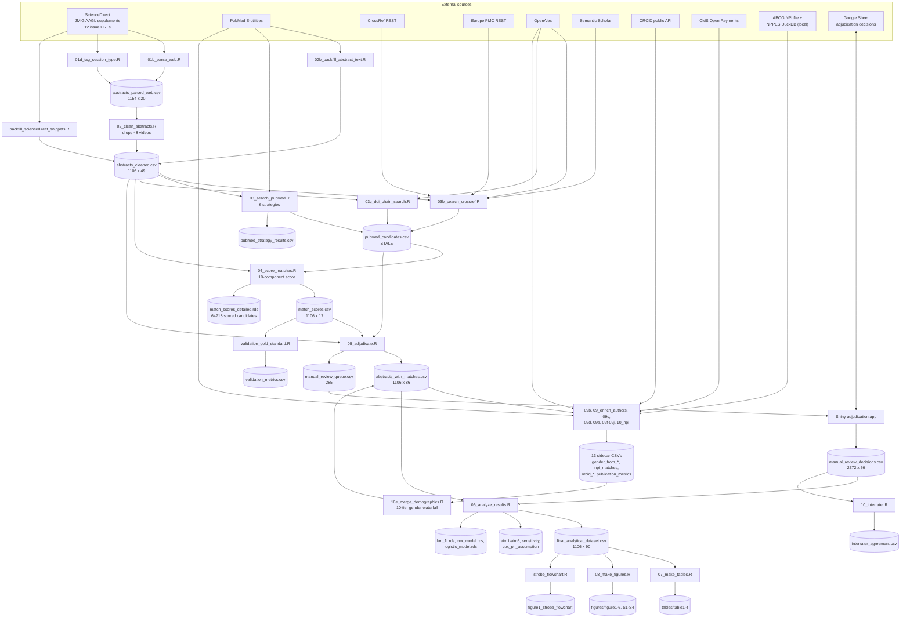

# Pipeline

Every stage, with its real inputs, transformation and outputs. Stage order is
the order in `00_run_all.R`. The machine-readable form of this document is
[`pipeline_manifest.yml`](pipeline_manifest.yml); the two are checked against
each other by `tests/testthat/test-docs_drift.R`.

`00_run_all.R` sources 30 script paths (28 distinct files; `01_parse_pdf.R` and
`01c_compare_sources.R` are conditional and never fire in the current tree).

**Ten pipeline scripts are not reachable from `00_run_all.R` at all**:
`10b_resolve_names_openalex.R`, `10c_coauthor_triangulation.R`,
`10d_orcid_demographics.R`, `10e_merge_demographics.R`,
`10f_senior_author_triangulation.R`, `10g_second_author_triangulation.R`,
`run_demographics.R`, `strobe_flowchart.R` and every
script in `scripts/` except the three backfills that are sourced explicitly.

This matters: **`R/10e_merge_demographics.R` is what puts the demographics block into
`output/abstracts_with_matches.csv` — `gender_unified`, `gender_source`,
`gender_n_sources`, `gender_conflict`, the nine `npi_*` columns,
`orcid_country`, `orcid_institution`, `state_unified` and
`subspecialty_unified` — and `00_run_all.R` never calls it.** A fresh `Rscript 00_run_all.R` produces an
`abstracts_with_matches.csv` without `gender_unified`, `npi_*`,
`state_unified` or `subspecialty_unified`, and `06_analyze_results.R` then
silently drops those terms from the Cox and logistic models because it selects
predictors with `intersect(..., names(km_data))`. The demographics block must be
run separately with `Rscript R/run_demographics.R`, which sources `09c`, `10b`,
`10`, `10d`, `10f`, `10g`, `09f`–`09j` and finally `10e`. `run_demographics.R`
wraps each step in `tryCatch()` and only warns on failure, so a partial
demographics merge is silent as well. See
[FAILURE_MODES.md](FAILURE_MODES.md) F8.

---

## Data-flow diagram

---

## Stage detail

Format: **INPUT → SCRIPT/FUNCTION → TRANSFORMATION → OUTPUT.**

### 1. `R/01b_parse_web.R` — supplement ingestion

- **In**: 12 ScienceDirect issue URLs from `config.yml:congresses[*].sciencedirect_url`.
- **Functions**: `scrape_listing_page()`, `parse_sd_item()`,
  `fetch_sd_html_cached()`, `fetch_article_abstract()`.
- **Transformation**: fetch the issue listing; parse title, authors, page range,
  DOI, article URL, PDF URL and ScienceDirect subtype from each
  `li.js-article-list-item`; filter to conference abstracts; deduplicate by DOI
  then title; assign `abstract_id`; then fetch each article page (disk-cached in
  `data/cache/sd_html/`, 1,154 files) and extract structured abstract sections,
  falling back to the `#preview-section-snippets` panel for paywalled years.
- **Out**: `data/processed/abstracts_parsed_web.csv` and a byte-identical
  `abstracts_parsed.csv`. Grain: one presentation. 1,154 × 20.
- **Short-circuit**: if the CSV already has ≥ 80 × *n*congresses rows
  covering every configured year, the scrape is skipped entirely
  (`R/01b_parse_web.R:331-341`). In practice **the scrape never re-runs.**
- **Caveat**: truncated at ~100 items per congress. See
  [COHORT_ASSEMBLY.md](COHORT_ASSEMBLY.md) §5.

### 1d. `R/01d_tag_session_type.R` — programme section

- **In**: the same 12 URLs; `abstracts_parsed_web.csv` as a PII bridge.
- **Function**: `tag_one_congress()`, `merge_session()`.
- **Transformation**: `xml_find_all(page, "//h3[contains(@class,'section-title')] | //li[contains(@class,'js-article-list-item')]")`
  walked in document order, carrying the current section heading forward; the
  heading is collapsed to `Oral`/`Video`/`Poster` by substring.
- **Out**: `session_type` written **in place** into `abstracts_parsed_web.csv`,
  `abstracts_parsed.csv`, `abstracts_cleaned.csv` and
  `output/abstracts_with_matches.csv`.

### 2. `R/02_clean_abstracts.R` — cohort definition and predictor derivation

- **In**: `abstracts_parsed.csv`.
- **Transformation**, in order: impute `NA` session type to `Oral` and drop
  `Video` (**1,154 → 1,106**); strip `^\d+\s+[-–]\s*` session-number title
  prefixes; split and normalise author names (`normalize_author()`), setting the
  last author to `NA` when the ScienceDirect list was ellipsis-truncated; build
  `abstract_text` by concatenating the structured sections, falling back to
  `abstract_full_text`; extract 10 TF keywords; derive ~20 predictor variables
  by regex over `search_text = coalesce(abstract_full_text, abstract_text, title)`;
  classify `result_positivity`; compute an MD5 `abstract_hash`.
- **Out**: `data/processed/abstracts_cleaned.csv`, 1,106 × 49.
- **Caveat**: the predictors are derived here, **before** the text backfills in
  stages 2b/2c, and are never recomputed. See
  [FAILURE_MODES.md](FAILURE_MODES.md) F3.

### 2b. `R/02b_backfill_abstract_text.R`

- **In**: `abstracts_cleaned.csv` rows with `abstract_text` shorter than 10
  characters and a DOI; PubMed E-utilities.
- **Transformation**: `esearch` the DOI, `efetch` the XML (cached in
  `data/cache/pubmed_xml/`), concatenate `AbstractText` nodes.
- **Out**: `abstract_text` patched in place. Section columns are **not** filled.

### 2c. `scripts/backfill_sciencedirect_snippets.R`

- Same target column, from the cached ScienceDirect `#preview-section-snippets`
  panel. Together 2b and 2c raise `abstract_text` coverage for 2012–2018 from
  ~0% to 59–100%, except 2017 which remains at 1/97.

### 3. `R/03_search_pubmed.R` — six-strategy PubMed search

- **In**: `abstracts_cleaned.csv`; resume state in
  `data/cache/checkpoints/pubmed_search_checkpoint.rds`.
- **Functions**: `build_search_strategies()`, `rate_limited_search()`,
  `fetch_pubmed_details()`, `parse_pubmed_xml()`, `is_supplement_article()`.
- **Out**: `pubmed_candidates.csv` (one row per abstract × PMID),
  `pubmed_strategy_results.csv`, `output/search_strategy_efficacy.csv`.
- See [PUBLICATION_SEARCH.md](PUBLICATION_SEARCH.md) for every query.

### 3b. `R/03b_search_crossref.R` — four supplementary sources

CrossRef (only for abstracts with ≤ 2 PubMed hits), Europe PMC, OpenAlex and
Semantic Scholar for all abstracts. New PMIDs are resolved through
`fetch_pubmed_details()` and appended to `pubmed_candidates.csv`, which the
script **rewrites in place**.

### 3c. `R/03c_doi_chain_search.R` — reverse citation

Queries OpenAlex for works citing each abstract's own supplement DOI.
Output merged into the pool by stage 3b on the next run.

### 4. `R/04_score_matches.R` — composite scoring

- **In**: `abstracts_cleaned.csv` × `pubmed_candidates.csv`.
- **Functions**: `score_abstract_candidates()` → `score_match()` →
  `classify_match()`.
- **Out**: `match_scores.csv` (1,106 × 17, best candidate flattened) and
  `match_scores_detailed.rds` (list-column with all 64,718 scored candidates).
- See [MATCHING_ALGORITHM.md](MATCHING_ALGORITHM.md).

### 5. `R/05_adjudicate.R` — join publication metadata, build the review queue

- **In**: `abstracts_cleaned.csv`, `match_scores.csv`, `pubmed_candidates.csv`.
- **Transformation**: join the best PMID's publication fields; compute
  `pub_date` as the first day of the PubMed issue month and
  `months_to_pub = (pub_date − congress_date)/30.44`; blank the publication
  fields for `no_match`/`no_candidates`/`possible`; retain `excluded`
  abstracts in the cohort.
- **Out**: `output/abstracts_with_matches.csv`,
  `output/manual_review_queue.csv` (285 rows: `probable`, `possible` or any tie).

### 5b–5i. Enrichment (`09*`, `10_npi_matching.R`, `run_demographics.R`)

See [AUTHOR_ENRICHMENT.md](AUTHOR_ENRICHMENT.md). Each script writes a sidecar
CSV; `10e_merge_demographics.R` joins them onto
`output/abstracts_with_matches.csv` and resolves the ten-tier gender waterfall.

### 6. `R/06_analyze_results.R` — decisions, outcome, and all five aims

- **In**: `output/abstracts_with_matches.csv`,
  `output/manual_review_decisions.csv`.
- **Functions**: `dedup_decisions_for_analysis()`, `assign_final_published()`
  (both in `R/utils_decisions.R`).
- **Out**: `output/final_analytical_dataset.csv` (1,106 × 90) plus the aim CSVs
  and three model RDS files. See
  [STATISTICAL_ANALYSIS.md](STATISTICAL_ANALYSIS.md).

### 7/8. Tables and figures

`R/07_make_tables.R` and `R/08_make_figures.R` each re-derive `final_published`
with their own inline `case_when`, reading `abstracts_with_matches.csv` rather
than `final_analytical_dataset.csv`. Their dedup omits the human-over-AUTO
precedence rule. The two currently agree with stage 6 on all 1,106 rows —
verified — but the duplication is a live drift hazard
([FAILURE_MODES.md](FAILURE_MODES.md) F9).

`R/strobe_flowchart.R` produces the cohort figure with `stopifnot()` assertions,
and is now the only generator of one. `R/strobe_flow_diagram.R`, an older
DiagrammeR version of the same idea, was deleted on 2026-09-05: it was absent
from `00_run_all.R` and its outputs were gitignored, so it produced a third flow
diagram that nothing read.

---

## Scripts in `R/` and `scripts/` not shown above

| Script | Status |
|---|---|
| `R/01_parse_pdf.R` | PDF fallback; only sourced if web parsing produced nothing. Never exercised. |
| `R/01c_compare_sources.R` | Conditional on an `abstracts_parsed_pdf.csv` that does not exist. |
| `R/09e_fidelity_checks.R` | Compares abstract to matched paper; writes `fidelity_checks.csv`. |
| `R/10_interrater.R` | Cohen's kappa; currently returns `NA` because `irr` is not installed. |
| `R/validation_gold_standard.R` | Scores the algorithm against 50 manually labelled abstracts. |
| `scripts/rescue_2016.R` | One-off recovery for a rate-limited congress year. |
| `scripts/jmig_2017_scraper.js`, `scripts/ingest_jmig_2017_json.R` | Failed 2017 text recovery (CORS). Retained as a record. |
| `scripts/prefill_algorithm_decisions.R` | Writes the `AUTO` rows into the Google Sheet. |
| `scripts/backfill_*.R` | Add newly introduced columns to an existing sheet or CSV. |
| `scripts/cleanup_no_match_rows.R` | Blanks matched-publication fields on `no_match` decisions. |
| `scripts/warm_sd_cache.R` | Pre-populates `data/cache/sd_html/`. |
